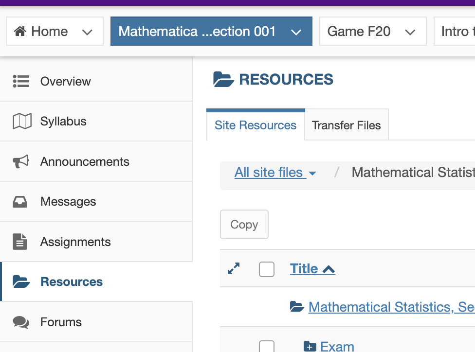
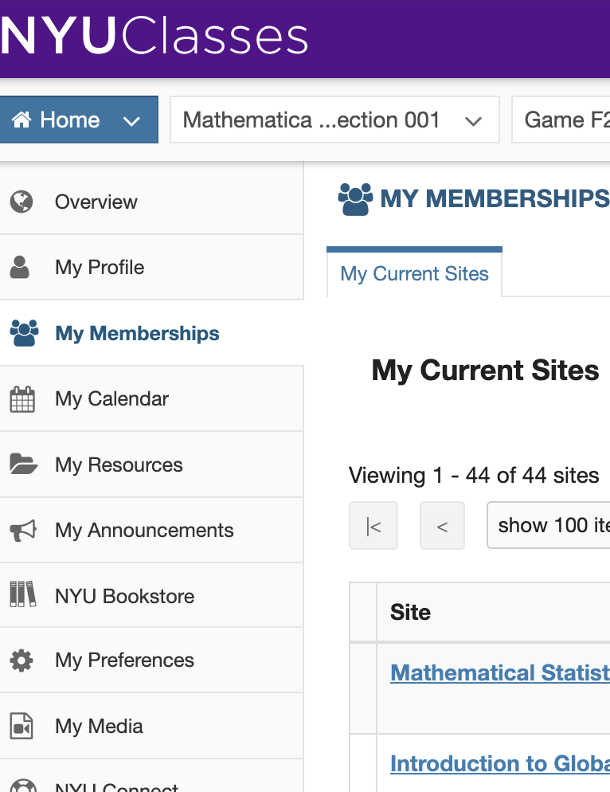
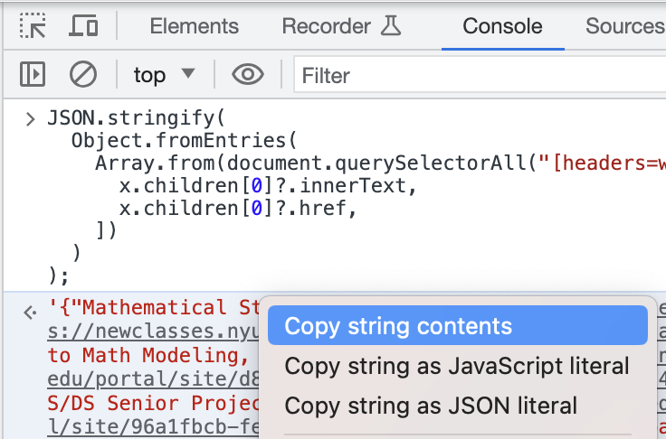
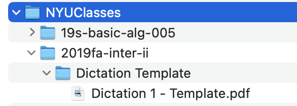

# NYU Classes `Resources` Scraper

newclasses.nyu.edu is going away soon and with it all the course material there will die. This script allows you to download some of the course materials from the website.

This repo contains a script to download all of the Resources for classes listed
on NYU Classes (newclasses.nyu.edu).



**New: Download the a web archive of NYU Classes using this tool**: https://github.com/FrederickGeek8/nyuclasses-web-archive

### Grabbing the code

You can get a copy of this code by

```bash
git clone https://github.com/FrederickGeek8/nyuclasses-resource-scraper.git;
cd nyuclasses-resource-scraper
```

### Install Dependencies:

```bash
pip install -r requirements.txt
```

### Get Class List

You can get the list of classes to scrape by going to "My Memberships" on
[newclasses.nyu.edu](newclasses.nyu.edu) and running the following Javascript in
your web browser's developer console.



You can get to the console by Right-Clicking on the webpage, then clicking
`Inspect`, then clicking the Console tab.

```javascript
JSON.stringify(
  Object.fromEntries(
    Array.from(document.querySelectorAll("[headers=worksite]")).map((x) => [
      x.children[0]?.innerText,
      x.children[0]?.href,
    ])
  )
);
```

Copy the result and save it to a text file. We recommend `classes.json` in this
folder. It should look like

```json
{
  "Class Name 1": "https://newclasses.nyu.edu/portal/site/numbers",
  "Class Name 2": "https://newclasses.nyu.edu/portal/site/differentnumbers"
}
```



spacing doesn't matter. You can remove the `"key": "value",` pair from that file for classes you don't want to scrape. By default we scrape all of the classes listed on that webpage.

### Usage:

You can run the following:

```bash
python GetClassResourceData.py --user user --pass mypassword123 --json classes.json --outdir /Backup/NYUClasses
```

with

- `user`: Your NYU username
- `pass`: Your NYU password
- `json`: The path to the JSON with the classes you want to save
- `outdir`: The path to where you want to save the class folders

It will produce at `outdir` a structure like the following: the contents of the
`Resources` tab for each class in the JSON file:


This script will skip downloading files that already exist and (1) are newer on the local machine and (2) have the same file size as the remote. In order to redownload files by force, you must delete the files from your filesystem first.

### Notes

1. This was tested on Python 3.9.16. It should hopefully work for Python >=3.9
